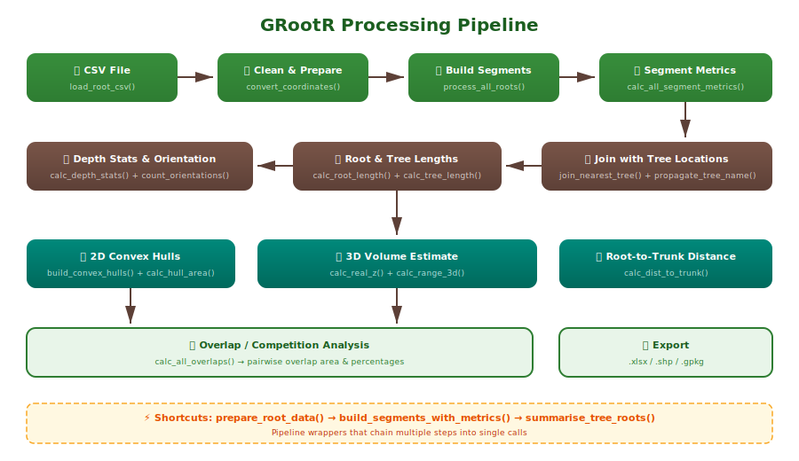

```{r, include = FALSE}
knitr::opts_chunk$set(
  collapse = TRUE,
  comment = "#>",
  eval = FALSE
)
```

## Overview

**GRootR** processes Ground Penetrating Radar (GPR) root survey data through a pipeline that transforms raw CSV point data into spatial segments with geometric metrics, 2D/3D morphology estimates, and inter-tree competition analysis.



## Installation

```{r}
# install.packages("pak")
pak::pak("j-miszczyszyn/GRootR")
```

## Step 1: Load and prepare data

The simplest approach uses `prepare_root_data()`, which handles loading, cleaning, and coordinate conversion in one call:

```{r}
library(GRootR)

df <- prepare_root_data(
  path = "path/to/roots.csv",
  sep = ";",
  x_col = "X.SRS.units.",
  y_col = "Y.SRS.units.",
  z_col = "Depth.m.",
  negate_z = TRUE,
  survey_col = "Survey",
  plot_position = 4
)
```

This does three things internally:

1. **`load_root_csv()`** — reads the CSV and fills missing `ROOT_ID` values using last observation carried forward
2. **`split_survey_column()`** — extracts the plot identifier from a composite survey/filename column
3. **`convert_coordinates()`** — converts X, Y, Z columns to numeric; negates depth so below-surface = negative

If your CSV has different column names, adjust the parameters accordingly.

## Step 2: Build segments with metrics

Convert root node points into line segments and compute all geometric metrics:

```{r}
segments <- build_segments_with_metrics(df, crs = 2178)
```

This creates an `sf` object where each row is a line segment between two consecutive root nodes, with columns:

- `length_3d` — 3D Euclidean distance (meters)
- `azimuth` — bearing from north, 0–360°
- `inclination_angle` — angle from horizontal plane (degrees)
- `slope_category` — classified as "horizontal", "slight", "moderate", "steep", or "vertical"
- `orientation` — binary: "vertical" or "horizontal"
- `pX, pY, pZ` — start point coordinates
- `kX, kY, kZ` — end point coordinates

## Step 3: Join with tree locations

If you have a shapefile (or other spatial file) with tree stem positions:

```{r}
library(sf)
trees <- st_read("trees.shp") %>%
  st_zm() %>%                          # drop Z if present
  select(Name, geometry)               # keep only ID + geometry

joined <- join_nearest_tree(segments, trees, tree_id_col = "Name", max_dist = 1.5)
joined <- propagate_tree_name(joined, tree_id_col = "Name")
```

`join_nearest_tree()` spatially matches segments within `max_dist` meters of a tree point. `propagate_tree_name()` then ensures ALL segments of the same `ROOT_ID` inherit the tree identity, even if only one segment was close enough to match.

## Step 4: Root and tree level metrics

```{r}
# Total length per individual root
joined <- calc_root_length(joined)

# Total length per tree (sum of all roots)
joined <- calc_tree_length(joined)

# Classify into depth bins (20 cm default)
joined <- assign_depth_class(joined, bin_m = 0.2)

# Per-tree depth statistics
depth_stats <- calc_depth_stats(joined)

# Count vertical vs horizontal segments per tree
orientations <- count_orientations(joined)
```

## Step 5: 2D convex hulls

Build polygons representing the horizontal spread of each tree's root system:

```{r}
hulls <- build_convex_hulls(joined, crs = 2178)
hulls <- calc_hull_area(hulls)

# Save as shapefile
sf::st_write(hulls, "root_polygons_2D.shp")
```

Each polygon has: `area_2d` (m²), `extent_x` and `extent_y` (bounding box dimensions).

## Step 6: 3D volume estimate

Estimate the bounding volume as `vertical_range × area_2d`:

```{r}
z_range <- calc_real_z(joined)
volume  <- calc_range_3d(z_range, hulls)
```

## Step 7: Overlap / competition analysis

Calculate how much root systems of neighboring trees overlap:

```{r}
overlaps <- calc_all_overlaps(hulls)
```

Returns a table with: `tree_1`, `tree_2`, `overlap_area` (m²), `overlap_pct_tree1`, `overlap_pct_tree2`.

## Step 8: Root-to-trunk distance

```{r}
merged <- merge_root_segments(joined_sf)
merged <- calc_dist_to_trunk(merged, trees, tree_id_col = "Name")
```

## All-in-one summary

For a quick tree-level summary combining depth, orientations, hulls, and volume:

```{r}
tree_summary <- summarise_tree_roots(joined, crs = 2178)

# Access components:
tree_summary$depth
tree_summary$orientations
tree_summary$hulls
tree_summary$volume
```

## Exporting results

```{r}
# To Excel (without geometry)
joined_df <- sf::st_drop_geometry(joined)
openxlsx::write.xlsx(joined_df, "root_segments_database.xlsx")

# Overlap table
openxlsx::write.xlsx(overlaps, "root_competition.xlsx")

# Spatial data
sf::st_write(hulls, "root_hulls.gpkg")
```
